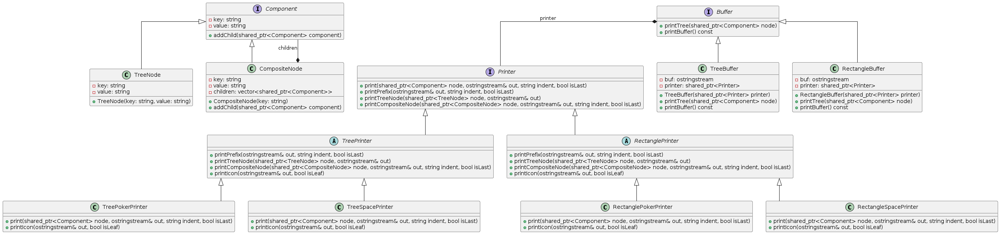
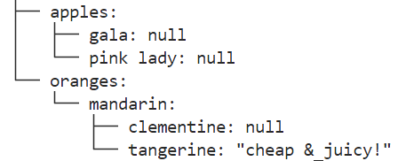
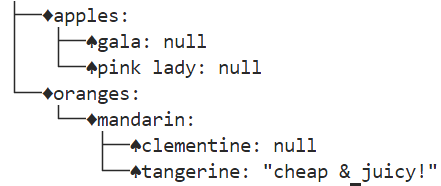
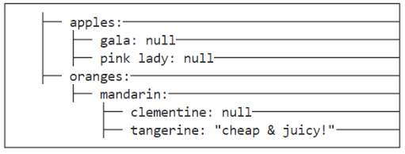
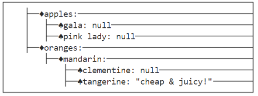

# Funny_Json_Editor设计文档

## 架构设计

- 类图

  - 使用plantUML绘制的结果如下
    
- 设计说明

  - Component类

  > 用于将json文件用多叉树结构存储，使用了组合模式的设计模式
  >

  - Component
  - TreeNode：Component
  - CompositeNode：Component
  - Printer类

  > 用于将多叉树加上枝干，便于打印；使用抽象工厂方法，结合建造者思想完成设计。注意：这一步不会直接在输出流打印任何文字，它会返回一个构造完毕的Buffer
  >

  > Printer基类可视为Builder，它定义了建造的步骤。
  >

  > 每个抽象工厂(矩形|树形风格)重写了建造的每个步骤
  >

  > 具体工厂生成了不同的符号簇
  >

  - Printer
  - TreePrinter：Printer
  - RectanglePrinter：Printer
  - TreePokerPrinter：TreePrinter
  - TreeSpacePrinter：TreePrinter
  - RectanglePokerPrinter：RectanglePrinter
  - RectangleSpacePrinter：RectanglePrinter
  - Buffer类

  > 相当于产品，只能将缓冲区的内容放入输出流。RectangleBuffer在输出之前需要加上边框。
  >

  - Buffer
  - TreeBuffer：Buffer
  - RectangleBuffer：Buffer

## 添加抽象工厂以生成新的风格
- 在Printer.hpp内，增加新的抽象工厂类即可

## 运行截图

- 树形+默认图标簇

  
- 树形+poker

  
- 矩形+默认图标簇

  
- 矩形+poker

  

## 注意

1. 矩形风格的设计没能完全按照要求的格式打印，万分抱歉
