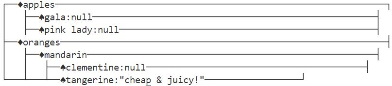

# Funny_Json_Editor设计文档

## 架构设计

- 类图

  - 使用plantUML绘制的结果如下
    

- 设计说明

  - Component类

  > 用于将json文件用多叉树结构存储，使用了组合模式的设计模式
  >

      - Component
      - TreeNode：Component
      - CompositeNode：Component
    - Printer类

  > 用于将多叉树加上枝干，便于打印；使用抽象工厂方法，结合建造者思想完成设计。注意：这一步不会直接在输出流打印任何文字，它会返回一个构造完毕的Buffer
  >

  > Printer基类可视为Builder，它定义了建造的步骤。
  >

  > 每个抽象工厂(矩形|树形风格)重载了建造的每个步骤
  >

  > 具体工厂生成了不同的符号簇
  >

      - Printer
      - TreePrinter：Printer
      - RectanglePrinter：Printer
      - TreePokerPrinter：TreePrinter
      - TreeSpacePrinter：TreePrinter
      - RectanglePokerPrinter：RectanglePrinter
      - RectangleSpacePrinter：RectanglePrinter
    - Buffer类

  > 相当于产品，只能将缓冲区的内容放入输出流。RectangleBuffer在输出之前需要加上边框。
  >

      - Buffer
      - TreeBuffer：Buffer
      - RectangleBuffer：Buffer

## 添加抽象工厂以生成新的风格
- 在Printer.hpp内，增加新的抽象工厂类即可

## 运行截图

- 树形+默认图标簇

  
- 树形+poker

  
- 矩形+默认图标簇

  
- 矩形+poker

  

## 注意

1. 矩形风格的设计没能完全按照要求的格式打印，万分抱歉

# 重构版本
- 类图
  - 使用plantUML绘制的类图如下：
    

- 设计说明
  - Component类

  > 使用了组合模式进行设计
  >
      - Component
      - TreeNode:Component
      - Composite:Component
  
  - Iterator类
  > 使用迭代器模式进行设计，用于对Component的访问，有利于隔离用户和节点
  >
      - Iterator
      - TreeIterator:Iteraor
  
  - Printer类
  > 相当于策略模式的上下文，用于和用户交互
  > 完成strategy的设定、调用各种函数
  > 
      - Printer
  
  - PrintStrategy类
  > 相当于抽象策略
  >
      - TreeStrategy
      - RectangleStrategy
  > 相当于具体策略
  >
      - TreePokerStrategy:TreeStrategy
      - TreeSpaceStrategy:TreeStrategy
      - RecPokerStrategy:RectangleStrategy
      - RecSpaceStrategy:RectangleStrategy
  
## 运行截图：
  - Tree+Poker:
    
    

  - Tree+Space

    

  - Rec+Poker

    
  
  - Rec+Space

    

## 注意
  - 本次实验解决了上次实验的几个问题：
    - hpp不规范
      - 上次实验图求方便，没有将声明和实现分离，不符合规范
    - 输出
      - 上次实验没有完全按照要求的格式输出，本次完成修正
  - 本次实验的问题
    - 本次实验由于按照标准进行输出，由于制表符如"┤"等均占据两个空格的宽度，导致我无法对齐最后一列
    - 前一次实验由于是在原本的输出加上外框，所以规避了这个问题
  
  - 实验改进
    - 使用cmake进行编译
